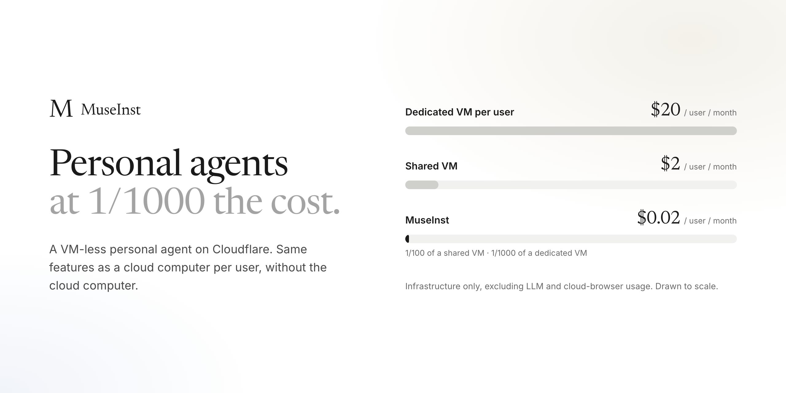
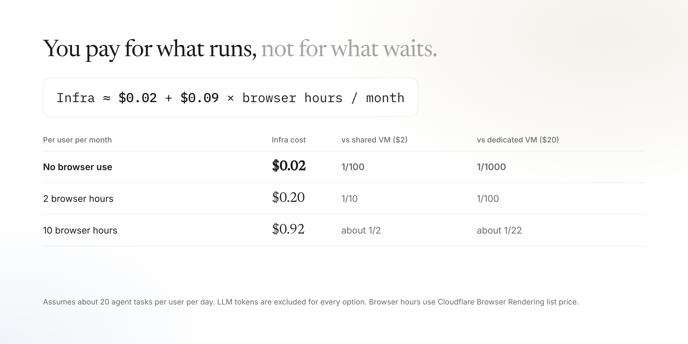
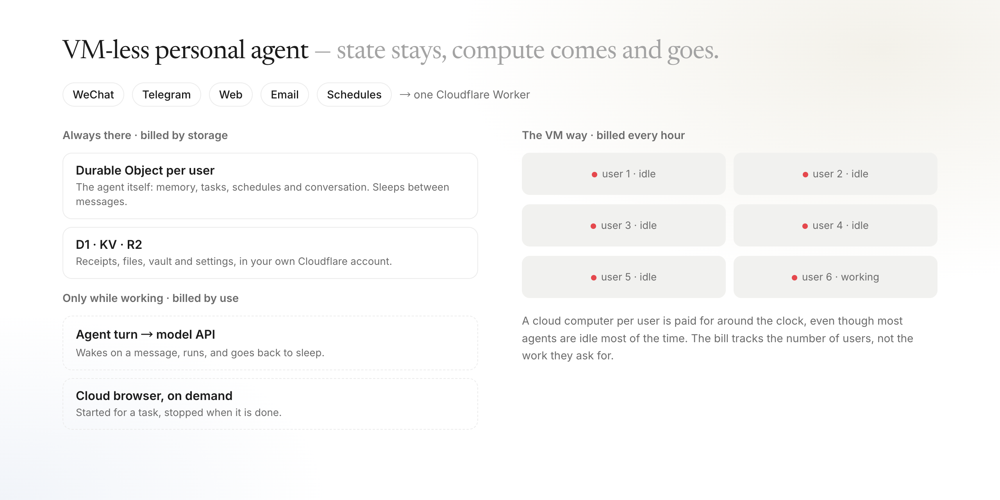
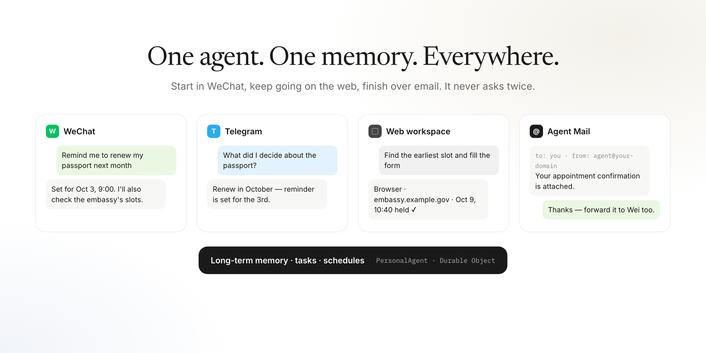

<div align="center">

# MuseInst

**Personal agents at 1/1000 the cost.**<br>
**Personal Agent，成本降到 1/1000。**

About **$0.02 per user per month**, roughly what one SMS verification code costs: **1/100** of a shared VM and **1/1000** of a dedicated VM per user, with the same features. Model and browser usage are billed separately.<br>
每个用户每月约 **$0.02**，和一条短信验证码差不多：是共享 VM 的 **1/100**、独享 VM 的 **1/1000**，功能一样都有。大模型和云浏览器按用量另计。

<br>

<a href="https://deploy.workers.cloudflare.com/?url=https%3A%2F%2Fgithub.com%2FAaronWong1999%2Fmuseinst"></a>

**[→ Deploy to your Cloudflare account · 一键部署到你的 Cloudflare](#deploy-to-your-cloudflare-account)**

<br>

[](LICENSE) [](https://developers.cloudflare.com/workers/) [](https://github.com/AaronWong1999/museinst/stargazers)

[Website 官网](https://museinst.com) · [Cost 成本](#where-the-cost-goes) · [Architecture 架构](#vm-less-personal-agent) · [Enterprise 企业版](#enterprise) · [X / Twitter @aaron0x10](https://x.com/aaron0x10)



</div>

### Everyone will have a personal agent. Not everyone needs a cloud computer. · 每个人都会有一个 Personal Agent，但不是每个人都需要一台云电脑

Grok Bot, Muse, Instinct: personal agents are everywhere, and a cloud computer per user has quietly become the default. That has kept them a big-company game.

MuseInst moves the whole agent onto Cloudflare with no VM. Each user's agent lives in a Durable Object with its memory, tasks and schedules; compute only shows up while it works. About $0.02 per user per month, roughly one SMS verification code. Any product can plug it in, and one person can run it on Cloudflare's free tier.

- **One click to deploy.** Nothing to fill in, no API key: the model runs on Workers AI in your account.
- **Lives in WeChat.** Talk to it in WeChat or Telegram, no app to install. It has its own email address and a cloud browser you can take over.
- **Open source.** The architecture is the product. Fork it, ship it, put it inside your app.

We built it over the Mid-Autumn holiday, so it is early, and a hosted demo shows it running. The goal is simple: make the personal agent infrastructure, so every product can have one.

Grok Bot、Muse、Instinct……Personal Agent 越来越多，给每个用户配一台云电脑几乎成了标配，让它一直只是大厂的游戏。

MuseInst 把整个 Agent 搬到 Cloudflare 上，不用 VM。每个用户的 Agent 住在一个 Durable Object 里，记忆、任务和定时计划都在里面，算力只在干活时出现。每个用户每月约 $0.02，和一条短信验证码差不多。任何产品都能接上，一个人用 Cloudflare 的免费额度也能跑。

- **一键部署。** 什么都不用填，不需要 API Key，模型用你账号里的 Workers AI。
- **住在微信里。** 在微信或 Telegram 里直接对话，不用装 App。它有自己的邮箱，还有可以随时接管的云浏览器。
- **开源。** 架构本身就是产品。Fork、上线，或者放进你自己的 App。

这是我们用中秋几天写出来的，还很早期，托管 Demo 证明了它能跑起来。目标很简单：让 Personal Agent 成为基础设施，让每个产品都能有一个。

## Where the cost goes

A cloud computer per user is billed around the clock, even though most agents sit idle most of the day. MuseInst has nothing to keep running between messages, so an idle user costs almost nothing.<br>
每人一台云电脑，不管用不用都在按小时计费，而大多数 Agent 一天里大部分时间都在空闲。MuseInst 在两条消息之间没有任何东西需要常驻，所以空闲的用户几乎不花钱。



**Cost methodology · 成本口径**

- Agent runtime: about 20 tasks per user per day without a browser comes to roughly $0.01 per user per month in Workers, Durable Objects, D1, KV and R2 usage. We budget $0.02.<br>
  Agent 运行时：每个用户每天约 20 个任务、不用浏览器，Workers、Durable Objects、D1、KV、R2 的用量约合每月 $0.01，预算按 $0.02 计。
- Cloud browser: billed per use at Cloudflare's Browser Rendering price, $0.09 per browser hour after the included hours.<br>
  云浏览器：按用量计费，Cloudflare Browser Rendering 超出包含额度后为每小时 $0.09。
- LLM tokens are excluded for every option, including the VM baselines ($2 shared, $20 dedicated per user per month).<br>
  所有方案都不含大模型 Token，包括作为对比的 VM 方案（共享约 $2、独享约 $20 每用户每月）。

`Infra ≈ $0.02 + $0.09 × browser hours per month`

## VM-less personal agent



- **A Durable Object per user is the agent.** It holds memory, tasks, schedules and the conversation, wakes on a message, email or schedule, and sleeps again.<br>
  **每个用户一个 Durable Object，它就是 Agent 本体。** 记忆、任务、定时计划和对话都在里面；收到消息、邮件或定时触发时醒来，干完继续休眠。
- **The browser is started per task, not kept running.** Watch it live, take over for a sign-in or CAPTCHA, hand it back.<br>
  **浏览器按任务启动，不常驻。** 可以实时观看，遇到登录或验证码时接管，完成后交还。
- **D1, KV and R2 hold everything else**, in your own Cloudflare account.<br>
  **其余数据存在 D1、KV、R2 里**，都在你自己的 Cloudflare 账号下。

## Same features

Cheap doesn't mean cut down. It is the full personal agent.<br>
便宜不等于缩水，这是完整的个人 Agent。



| | |
| --- | --- |
| **Channels** 渠道 | WeChat (iLink), Telegram, a web workspace and email, all sharing one memory · 微信、Telegram、网页工作区和邮件，共享同一份记忆 |
| **Cloud browser** 云浏览器 | Search, sign in, fill forms, download files; live view and takeover · 搜索、登录、填表、下载，支持实时观看与接管 |
| **Agent Mail** | An address of its own, with trusted people who get the permissions you grant · 它自己的邮箱地址，可信联系人按你授予的权限协作 |
| **Memory and time** 记忆与时间 | Long-term memory, tasks, reminders, recurring schedules · 长期记忆、任务、提醒、周期计划 |
| **Connectors** 连接器 | Google Workspace, GitHub, Feishu / Lark, any IMAP/SMTP mailbox · Google Workspace、GitHub、飞书 / Lark、任意 IMAP/SMTP 邮箱 |
| **Web** 网页 | Search and page fetch with no API key · 无需 API Key 的搜索与网页抓取 |
| **Model** 模型 | Workers AI out of the box, or any OpenAI-compatible endpoint · 默认 Workers AI，也可接任意 OpenAI 兼容接口 |
| **Receipts** 任务凭证 | Every finished task can produce a shareable receipt · 完成的任务可生成可分享的凭证 |

## Deploy to your Cloudflare account

<div align="center">

<a href="https://deploy.workers.cloudflare.com/?url=https%3A%2F%2Fgithub.com%2FAaronWong1999%2Fmuseinst"></a>

**No server and no API key to start. For personal use, the free tier is usually enough.**<br>
**不需要服务器，起步不需要任何 API Key。个人使用，大概率免费额度就够。**

</div>

1. Click **Deploy to Cloudflare** and sign in. Keep the defaults: Cloudflare creates the database, storage and Worker for you, and there is nothing to fill in.<br>
   点 **Deploy to Cloudflare** 并登录，保持默认设置即可。数据库、存储和 Worker 由 Cloudflare 自动创建，没有任何要填的东西。
2. Open your Worker URL and press **Claim my agent**. It is yours, and you are already talking to it.<br>
   打开 Worker 地址，点 **认领我的 Agent**。它就是你的了，直接开始对话。

The model runs on Workers AI in the same account, so there is no API key. Encryption keys are generated during the deploy and never leave Cloudflare. Claim within an hour of deploying; after that, redeploy to reopen the window, or set `ADMIN_KEY` as a Worker secret to use a password instead.<br>
模型用同一账号下的 Workers AI，不需要 API Key。加密密钥在部署时自动生成，不离开 Cloudflare。部署后一小时内认领；过了时间重新部署一次即可，也可以在 Worker 里设置 `ADMIN_KEY` 改用密码进入。

### Does it run on the free plan? · 免费计划够用吗？

Every service MuseInst uses has a free allowance. What usually runs out first is the browser.<br>
MuseInst 用到的每个服务都有免费额度，通常最先用完的是浏览器。

| Service 服务 | Used for 用途 | Workers Free | Workers Paid ($5/month) |
| --- | --- | --- | --- |
| Workers | Every request · 所有请求 | 100,000 requests/day | 10M requests/month included |
| Durable Objects (SQLite) | The agent itself · Agent 本体 | 100,000 requests/day, 5 GB | Included, then usage-based |
| D1 · KV | Tasks, receipts, settings · 任务、凭证、设置 | Free daily allowance | Included, then usage-based |
| R2 | Files and artifacts · 文件 | 10 GB free (R2 must be enabled on the account) | 10 GB free, then usage-based |
| Browser Rendering | Cloud browser · 云浏览器 | 10 minutes/day, 3 concurrent browsers | 10 hours/month included, then $0.09/hour |
| Workers AI | Default model · 默认模型 | Free daily allowance | Usage-based |

Light personal use fits the free plan. If your agent browses a lot, move to Workers Paid; you pay Cloudflare directly, never us.<br>
轻度个人使用在免费计划内。如果 Agent 经常用浏览器，升级到 Workers Paid；费用直接付给 Cloudflare，不经过我们。

You do **not** need a Telegram bot, WeChat login, Google OAuth app or model API key to start. Add channels and connectors later, one at a time.<br>
起步**不需要** Telegram Bot、微信登录、Google OAuth 或模型 API Key，渠道和连接器之后逐个添加。

**Live view and takeover · 实时观看与接管：** create a Cloudflare API token with *Browser Rendering: Edit* permission, then add two secrets to your Worker (Dashboard → Workers → your Worker → Settings → Variables and Secrets), or set `browser.liveView` in the local config below.<br>
创建一个带 *Browser Rendering: Edit* 权限的 Cloudflare API Token，然后在 Worker 设置里添加以下两个 Secret，或在下方本地配置里填写 `browser.liveView`。

| Name | Type | Value |
| --- | --- | --- |
| `BROWSER_LIVE_VIEW_ACCOUNT_ID` | Secret | Your Cloudflare account ID · 你的账号 ID |
| `BROWSER_API_TOKEN` | Secret | The API token · 上面创建的 Token |

### Local CLI deployment · 本地命令行部署

For a custom domain, Telegram, Agent Mail, your own model or more connectors, use the single local config file.<br>
自定义域名、Telegram、Agent Mail、自选模型或更多连接器，使用单一本地配置文件：

```bash
git clone https://github.com/AaronWong1999/museinst.git
cd museinst
npm ci
npm run config:init          # creates config/openinst.config.json
# edit config/openinst.config.json
npx wrangler login
npm run deploy
```

`config/openinst.config.json`, `.generated/` and `.dev.vars` are git-ignored. Never commit real credentials.<br>
本地配置与生成文件已被 Git 忽略，请勿提交真实凭证。

| Capability 能力 | How to enable 如何开启 |
| --- | --- |
| Web workspace 网页工作区 | Ready after first-run setup · 初始化后即可使用 |
| Cloud browser 云浏览器 | On by default · 默认开启 |
| WeChat 微信 (iLink) | Scan the login QR code on the admin page · 在管理页扫码登录 |
| Telegram | BotFather token + webhook secret in local config · 本地配置中填写 |
| Agent Mail | A domain on Cloudflare with Email Routing, plus outbound mail · 托管在 Cloudflare 的域名 + Email Routing |
| Google Workspace | Your own Google OAuth client · 你自己的 OAuth 应用 |
| GitHub · Feishu 飞书 · Lark | Your own OAuth / app credentials · 你自己的应用凭证 |
| IMAP / SMTP mail 邮箱 | Add the mailbox in Vault · 在 Vault 中添加 |
| Another model 其他模型 | Any OpenAI-compatible endpoint · 任意 OpenAI 兼容接口 |

## Enterprise

Want personal agents **inside your own product** for thousands of users? The cloud-computer bill is usually what stops it. MuseInst Enterprise adds multi-user workspaces, SSO, white-label branding, billing and admin on top of the same VM-less core.<br>
想在**你自己的产品里**给成千上万的用户配上 Personal Agent？通常卡住的是云电脑成本。MuseInst 企业版在同一个 VM-less 内核上增加了多用户、SSO、白标、计费与管理后台。

An Enterprise demo runs at [museinst.com](https://museinst.com), by invitation.<br>
企业版的线上 Demo 在 [museinst.com](https://museinst.com)，凭邀请码进入。

## Contribute · 参与贡献

```bash
npm ci
npm run verify     # public-source audit, types, tests and production build
npm run dry-run    # validates the Wrangler deployment shape
```

Issues and PRs are welcome. See [CONTRIBUTING.md](CONTRIBUTING.md) and [SECURITY.md](SECURITY.md), and keep credentials and personal data out of reports and fixtures.<br>
欢迎提 Issue 和 PR。请勿在报告或测试数据中放入凭证或个人信息。

## Contact · 联系

X / Twitter [@aaron0x10](https://x.com/aaron0x10) · run@museinst.com

## License · 许可

[Apache-2.0](LICENSE). See [third-party notices](THIRD_PARTY_NOTICES.md).<br>
采用 Apache-2.0 许可，详见许可文件与第三方声明。

MuseInst is an independent open-source project and is not affiliated with Meta, Cloudflare, Tencent, Telegram or Google. Product names are trademarks of their respective owners.<br>
MuseInst 是独立开源项目，与 Meta、Cloudflare、腾讯、Telegram、Google 均无关联。文中产品名称为各自所有者的商标。
